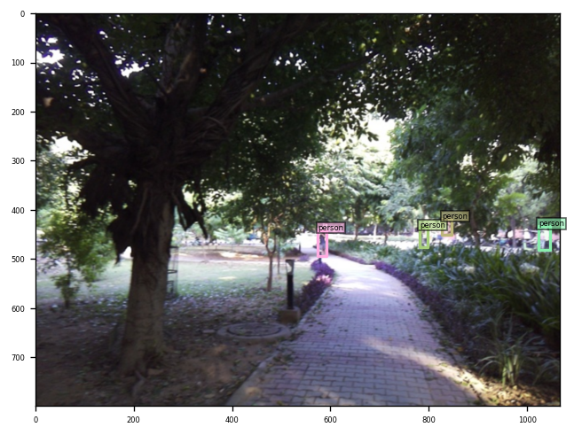
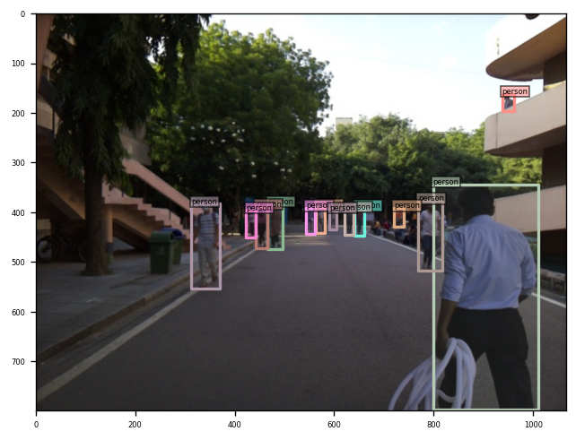
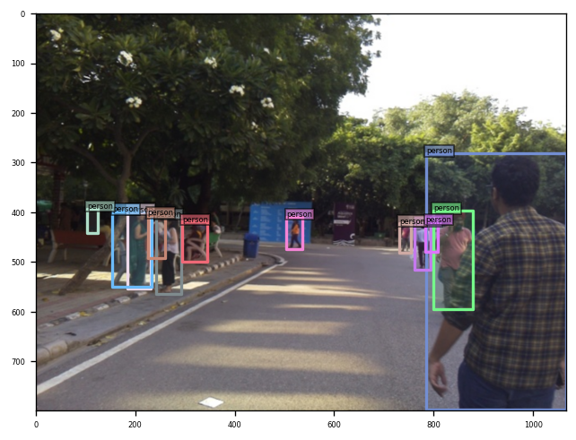
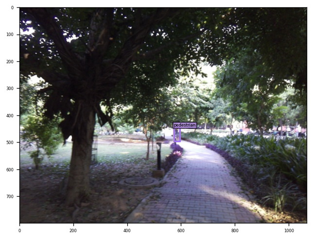
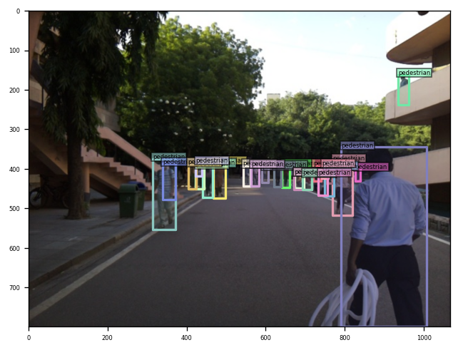
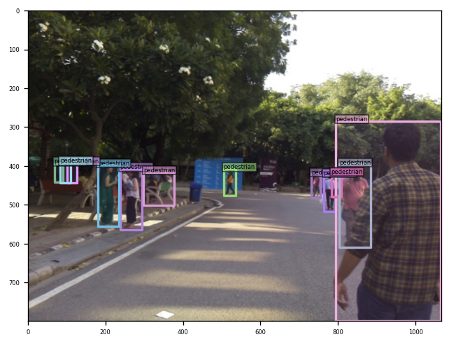

# Pedestrian Detection using DINO Object Detection Model

This repository demonstrates the zero-shot and fine-tuned implementation of **DINO: DETR with Improved DeNoising Anchor Boxes for End-to-End Object Detection** for Pedestrian Detection on custom dataset.

Link for finetuned model [Finetune Model](https://pdpuacin-my.sharepoint.com/:u:/g/personal/kunal_sce21_pdpu_ac_in/EZn3sIgs_q5FvCByX3nvkJ8BpE-t7TEjShbucyAf3u_itw?e=wyYcil)

> **_NOTE:_** All experiments are carried out in [colab notebook](Pedestrian.ipynb). Data Preparation was carried out on local machine then pushed to google drive. Model Training and Evaluation were performed in Google Colab Notebook with T4 GPU.

---

## Project Overview

The goal of this project is to train the DINO object detection model on a pedestrian dataset consisting of 200 images. The dataset is annotated in COCO format. The project involves visualizing the bounding boxes, evaluating the model, fine-tuning it, and analyzing its performance on a validation set.

---
## Dataset Preparation

1. The dataset consists of 200 images with corresponding annotations in COCO format.
2. **Split the dataset** into two sets:
   - Training set: 160 images
   - Validation set: 40 images
3. A Python script is provided to automate the dataset splitting process:
   - **Script**: `train_test_split.py`
   - This script reads the dataset and annotations, splits them into training and validation sets, and saves the result in the respective directories.
   
### How to run the script:
   ```sh
   python train_val_split.py 
   ```
```
processed_dataset/
  ├── train2017/
  ├── val2017/
  └── annotations/
  	├── instances_train2017.json
  	└── instances_val2017.json
```
---

## Repository Setup

1. **Clone the DINO repository** from the following link: [DINO GitHub Repo](https://github.com/IDEA-Research/DINO#installation).
   
2. **Set up the environment** follow the instructions given below

## Installation
> **_NOTE:_** Same as the original reposetory
   1. Clone this repo
   ```sh
   git clone https://github.com/IDEA-Research/DINO.git
   cd DINO
   ```

   2. Install Pytorch and torchvision

   Follow the instruction on https://pytorch.org/get-started/locally/.
   ```sh
   # an example:
   conda install -c pytorch pytorch torchvision
   ```

   3. Install other needed packages
   ```sh
   pip install -r requirements.txt
   ```
  4. Install NumPy and YAPF
  ```sh
  pip install "numpy<1.24" "yapf==0.40.1"
  ```


   5. Compiling CUDA operators
   ```sh
   cd models/dino/ops
   python setup.py build install
   # unit test (should see all checking is True)
   python test.py
   cd ../../..
   ```

---

## Evaluation

1. Download the pre-trained DINO-4scale model with the ResNet-50 (R50) backbone from the DINO repository.
2. Modify the configuration file to point to the pedestrian dataset.
3. Run the evaluation script to evaluate the pre-trained model on the validation set (40 images).
```sh
!bash /content/scripts/DINO_eval.sh /content/processed_dataset /content/checkpoint0011_4scale.pth
```
4. Report the bounding box Average Precision (AP) values.

Some of the visiualization of pre_trained model's prediction on validation data


---


---


---

## Fine-tuning

1. Fine-tune the pre-trained model on the pedestrian training set (160 images).
* added two more arguments in the config/DINO/DINO_4scale.py
```sh
bash /content/scripts/DINO_train.sh /content/processed_dataset
```
2. After fine-tuning, evaluate the model again on the validation set.

Link for finetuned model [Finetune Model](https://pdpuacin-my.sharepoint.com/:u:/g/personal/kunal_sce21_pdpu_ac_in/EZn3sIgs_q5FvCByX3nvkJ8BpE-t7TEjShbucyAf3u_itw?e=wyYcil)



---


---

---

## Results

## Evaluation

The model was evaluated on the pedestrian detection dataset using the COCO-style metrics. Below are the key evaluation metrics obtained:

### Initial Evaluation (Pre-trained model)

IoU metric: bbox
 Average Precision  (AP) @[ IoU=0.50:0.95 | area=   all | maxDets=100 ] = 0.471
 Average Precision  (AP) @[ IoU=0.50      | area=   all | maxDets=100 ] = 0.792
 Average Precision  (AP) @[ IoU=0.75      | area=   all | maxDets=100 ] = 0.537
 Average Precision  (AP) @[ IoU=0.50:0.95 | area= small | maxDets=100 ] = 0.398
 Average Precision  (AP) @[ IoU=0.50:0.95 | area=medium | maxDets=100 ] = 0.536
 Average Precision  (AP) @[ IoU=0.50:0.95 | area= large | maxDets=100 ] = 0.690
 Average Recall     (AR) @[ IoU=0.50:0.95 | area=   all | maxDets=  1 ] = 0.119
 Average Recall     (AR) @[ IoU=0.50:0.95 | area=   all | maxDets= 10 ] = 0.512
 Average Recall     (AR) @[ IoU=0.50:0.95 | area=   all | maxDets=100 ] = 0.582
 Average Recall     (AR) @[ IoU=0.50:0.95 | area= small | maxDets=100 ] = 0.539
 Average Recall     (AR) @[ IoU=0.50:0.95 | area=medium | maxDets=100 ] = 0.627
 Average Recall     (AR) @[ IoU=0.50:0.95 | area= large | maxDets=100 ] = 0.721


### Loss Values:

During the training and evaluation, the model's losses were recorded as follows:

- **Class Error**: 0.00
- **Total Loss**: 5.7286
- **Loss (bbox)**: 0.0804
- **Loss (giou)**: 0.4642
- **Loss (ce)**: 0.2284

These metrics indicate the model’s performance in detecting pedestrians, with high precision and recall for medium and large objects, and slightly lower performance for small objects.

### Fine-tuned Model Evaluation

IoU metric: bbox
 Average Precision  (AP) @[ IoU=0.50:0.95 | area=   all | maxDets=100 ] = 0.563
 Average Precision  (AP) @[ IoU=0.50      | area=   all | maxDets=100 ] = 0.898
 Average Precision  (AP) @[ IoU=0.75      | area=   all | maxDets=100 ] = 0.639
 Average Precision  (AP) @[ IoU=0.50:0.95 | area= small | maxDets=100 ] = 0.478
 Average Precision  (AP) @[ IoU=0.50:0.95 | area=medium | maxDets=100 ] = 0.654
 Average Precision  (AP) @[ IoU=0.50:0.95 | area= large | maxDets=100 ] = 0.757
 Average Recall     (AR) @[ IoU=0.50:0.95 | area=   all | maxDets=  1 ] = 0.124
 Average Recall     (AR) @[ IoU=0.50:0.95 | area=   all | maxDets= 10 ] = 0.583
 Average Recall     (AR) @[ IoU=0.50:0.95 | area=   all | maxDets=100 ] = 0.682
 Average Recall     (AR) @[ IoU=0.50:0.95 | area= small | maxDets=100 ] = 0.628
 Average Recall     (AR) @[ IoU=0.50:0.95 | area=medium | maxDets=100 ] = 0.742
 Average Recall     (AR) @[ IoU=0.50:0.95 | area= large | maxDets=100 ] = 0.836


### Loss Values:

During the training and evaluation, the model's losses were recorded as follows:

- **Class Error**: 0.00
- **Total Loss**: 4.1582
- **Loss (bbox)**: 0.0000
- **Loss (giou)**: 0.0000
- **Loss (ce)**: 0.2192

These metrics indicate the model’s performance in detecting pedestrians,with high precision and recall for medium and large objects, and somewhat lower performance for small objects

### Model Performance Summary
The metrics show a clear improvement in the model's performance after the finetune on custom dataset.